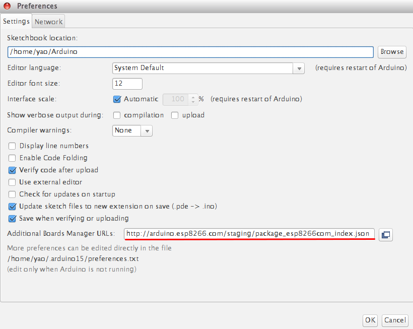
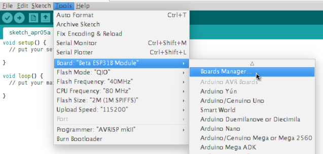
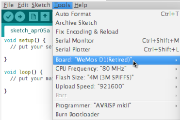
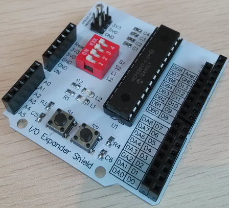

# LinkNode D1 wiki

## Introduction
LinkNode D1 is Arduino-compatible WiFi development board which is powered by the high integrated WiFi chip [ESP-8266EX](http://espressif.com/en/products/hardware/esp8266ex/overview).

Thanks for the contribution from open source community who have developed Arduino core for ESP8266, this let Aduino IDE program LinkNode D1 without any change. At the same time, LinkNode D1 has Arduino-compatible pin out which make it very easy to connect to Arduino shield.


## Features
* Powered by ESP-8266EX
* 11 Digital I/O pins
* 1 Analog Input pin
* 1 micro USB port for power/configure
* Power jack for 9-24V power input
* Compatible with [Arduino programming](https://github.com/pcduino/LinkNodeD1)
* Compatible with [NodeMCU](http://www.nodemcu.com/)
* OTA -- Wireless Upload(Program)

## Pin Mapping
| Arduino-Compatible Pins | ESP8266 Pins |
|:--------:|:--------:|
| D0        |    GPIO3    |
| D1        |    GPIO1   |
| D2       |    GPIO16    |
| D3       |    GPIO5    |
| D4       |    GPIO4    |
| D5       |    GPIO14    |
| D6       |    GPIO12    |
| D7       |    GPIO13    |
| D8       |    GPIO0    |
| D9     |    GPIO2    |
| D10      |    GPIO15    |
| D11     |    GPIO13    |
| D12     |    GPIO12    |
| D13     |    GPIO14    |
| D14     |    GPIO4    |
| D15     |    GPIO5    |

## Tutorials

### 1. Get started in Arduino

If you have used Arduino before, you will feel that the LinkNode D1 is as same as Arduino, and there is no difference between their programming. The only limitation of LinkNode D1 is that it only has 11 digital ports and 1 analog input port.  

#### a. Requirements
* [Arduino IDE](https://www.arduino.cc/en/Main/Software), (the latest version is **1.6.8** )
* The [Arduino core](https://github.com/pcduino/LinkNodeD1) for LinkNode D1

#### b. Install hardware package for LinkNode D1
- Install Arduino 1.6.8 from the [Arduino website](http://www.arduino.cc/en/main/software).
- Start Arduino and go to **File --> Preferences** .
- Enter ```http://arduino.esp8266.com/stable/package_esp8266com_index.json``` into **Additional Board Manager URLs** field. You can add multiple URLs, separating them with commas.


- Open Boards Manager from **Tools --> Board menu --> Boards Manager**.

- Search and install **esp8266** platform (and don't forget to select your ESP8266 board from Tools --> Board menu after installation).


#### c. Check the configuration of Board
Because the LinkNode D1 have not add the offcial ESP8266 Arduino core repository yet, so you can't find LinkNode D1 board on the boards list, but you can select the **WeMos D1(Retired)**, this board is fully compotiable with LinkNode D1.


#### d. Create a Arduino Project
* Connect LinkNode D1 to your PC
* Check your serial port which your PC recognize
* Enter the following source code and click the **Upload** button

```c
void setup() {
  // initialize digital pin GPIO2/D9 as an output.
  pinMode(BUILTIN_LED, OUTPUT);
}

// the loop function runs over and over again forever
void loop() {
  digitalWrite(BUILTIN_LED, HIGH);   // turn the LED on (HIGH is the voltage level)
  delay(1000);              // wait for a second
  digitalWrite(BUILTIN_LED, LOW);    // turn the LED off by making the voltage LOW
  delay(1000);              // wait for a second
}
```
* After finish uploading, please check the BLUE LED on the ESP-8266EX chip, is it blinking?

### 2. Hello World

* Take the steps above and run the following code:

```c
void setup() {
  Serial.begin(115200);
}

// the loop function runs over and over again forever
void loop() {
  Serial.println("Hello world!");
  delay(1000);              // wait for a second
}
```
* After finish uploading, and open the **Serial Monitor** in Arduino IDE
* The serial will print **Hello world!** in every second.

### 3. Use I/O expander shield with LinkNode D1



I/O Expander shield is a shield used to expand the number of I/Os of Arduino. It is based on the chipset MCP23017. The chipset MCP23017 communicates with Arduino Uno through I2C interface. It adds GPIOA and GPIOB, a total of 16 I/Os.  

* Mount the expander shield to LinkNode D1
* Program the source code to the board

```C
#include <Wire.h>

const byte  mcp_address=0x20;      // I2C Address of MCP23017 Chip
const byte  GPIOA=0x12;            // Register Address of Port A
const byte  GPIOB=0x13;            // Register Address of Port B
const byte  IODIRA=0x00;            // IODIRA register
const byte  IODIRB=0x01;            // IODIRB register

void setup()
{
  //Send settings to MCP device
  Wire.begin();              // join i2c bus (address optional for master)
  Wire.beginTransmission(mcp_address);
  Wire.write((byte)IODIRA); // IODIRA register
  Wire.write((byte)0x03); // set GPIOA-0/GPIOA-1 to inputs
  Wire.endTransmission();
}

void loop()
{
  Wire.beginTransmission(mcp_address);
  Wire.write((byte)GPIOA); // set MCP23017 memory pointer to GPIOB address
  Wire.endTransmission();
  Wire.requestFrom(0x20, 1); // request one byte of data from MCP20317
  int inputs=Wire.read(); // store the incoming byte into "inputs"

  if((inputs&0x01)==0)
  {
    Wire.beginTransmission(mcp_address);
    Wire.write(GPIOA);    // address bank A
    Wire.write((byte)0x04);  // value to send GPIOA-2 HIGH
    Wire.endTransmission();
  }
  if((inputs&0x02)==0)
  {
    Wire.beginTransmission(mcp_address);
    Wire.write(GPIOA);    // address bank A
    Wire.write((byte)0x08);  // value to send GPIOA-3 HIGH
    Wire.endTransmission();
  }
  else
  {
    Wire.beginTransmission(mcp_address);
    Wire.write(GPIOA);     // address bank A
    Wire.write((byte)0x00);  // value to send GPIOA LOW
    Wire.endTransmission();
  }
}
```
* Set all 4-bit DIP jumpers to ON
* Press the button S1 and S2 respectively.
* Press S1, L1 (RED) will turn on.
* Press S2, L2 (GREEN) will turn on.

### 4. WiFi Manager
The ESP8266 WiFi Connection manager with web captive portal, this Arduino library can make configure AP's SSID and password via web page when you want LinkNode D1 to connect to AP.

* Open Arduino IDE and go to **Sketch --> Include Library --> Manage Libraries**
* Search the **wifimanager** and install it


* Program the following source code:

```c
#include <ESP8266WiFi.h>          //https://github.com/esp8266/Arduino

//needed for library
#include <DNSServer.h>
#include <ESP8266WebServer.h>
#include <WiFiManager.h>         //https://github.com/tzapu/WiFiManager


void setup() {
    // put your setup code here, to run once:
    Serial.begin(115200);

    //WiFiManager
    //Local intialization. Once its business is done, there is no need to keep it around
    WiFiManager wifiManager;
    //reset saved settings
    //wifiManager.resetSettings();

    //set custom ip for portal
    wifiManager.setAPStaticIPConfig(IPAddress(10,0,1,1), IPAddress(10,0,1,1), IPAddress(255,255,255,0));

    //fetches ssid and pass from eeprom and tries to connect
    //if it does not connect it starts an access point with the specified name
    //here  "AutoConnectAP"
    //and goes into a blocking loop awaiting configuration
    wifiManager.autoConnect("LinkNodeAP");
    //or use this for auto generated name ESP + ChipID
    //wifiManager.autoConnect();

    //if you get here you have connected to the WiFi
    Serial.println("connected... :)");
}

void loop() {
    // put your main code here, to run repeatedly:
}
```

* After upload the program, the LinkNode D1 will create a AP called **LinkNodeAP**
* Use your mobile phone to connect this AP
* Open a browser and enter the ip address **10.0.1.1** and you will see the following website:


* Click the button **configure WiFi**
* Select your WiFi AP which you want to connect and enter your wifi password.
* If connecting failed, you can go to the same website to configure it again.
* Also, you can use Serial Monitor in Arduino IDE to check the status.

### 5. Connect to LinkSprite IO
[LinkSprite IO](www.linksprite.io) is an IoT platform which supports RESTful API and WebSocket. These make the mobile APP, website application or device connect it very easily. The following I will introduce is about how to use LinkNode D1 to communicate with LinkSprite IO platform.

#### a. Create a new account and device on LinkSprite.io
* Go to www.linksprite.io and sign up
* Enter your Email and password to create a new account
* Go to **My Account** to get your own API Key. The API Key is fatal because only add the Key in your codes, can the data sync to your IoTgo account.


* Click **My Device**, and choose **Create DIY Device**.


* Click the created device icon and get the DeviceID.


#### b. Update the source code using your own apikey and device ID
Device API which the LinkSprite IO support is JSON-based, which means all request and response data is enclosed in JSON format. Currently it supports 3 kind of request.
* **Update**: Update device status to LinkSprite IO
* **Query**: Get device status from LinkSprite IO

This demo will send http POST request to query the param--light on linksprite.io, if the **light** is on, then turn the LED, if off, then turn off the LED.

```c
#include <ESP8266WiFi.h>
#include <WString.h>

//the library are needed for autoconfig WiFi
#include <DNSServer.h>
#include <ESP8266WebServer.h>
#include <WiFiManager.h>       

// replace with your own API key and device ID,
String apikey = "xxxxxxxxxxxxxxxxxxxxxxxxxxxx";
const char* deviceID="xxxxxxxxxxxxx";

const char* server = "www.linksprite.io";

WiFiClient client;

void setup() {                
  Serial.begin(115200);
  pinMode(BUILTIN_LED, OUTPUT);

  WiFiManager wifiManager;

  wifiManager.setAPStaticIPConfig(IPAddress(10,0,1,1), IPAddress(10,0,1,1), IPAddress(255,255,255,0));
  wifiManager.autoConnect("LinkNodeAP");

  Serial.print("WiFi Connected ...\n");
  Serial.println("WiFi connected");
}

void loop() {

  if (client.connect(server,80)) {  
  String  postStr ="{";
          postStr +="\"action\":\"query\",";
          postStr +="\"apikey\":\"";
          postStr += apikey;
          postStr +="\",";
          postStr +="\"deviceid\":\"";
          postStr += deviceID;
          postStr +="\",";
          postStr += "\"params\":";
          postStr += "[";
          postStr += "\"light\"";
          postStr +="]";
          postStr +="}";

     client.print("POST /api/http HTTP/1.1\n");
     client.print("Host: ");
     client.print(server);
     client.print("\nContent-Type: application/json\n");
     client.print("Content-Length: ");
     client.print(postStr.length());
     client.print("\n\n");
     client.print(postStr);     
  }
  delay(1000);

  Serial.println("Store response...");
  String request = "";
  while (client.available()) {
    char c = client.read();
    request +=c;
  }

  if (request!= NULL)
  {
    int index1 = request.indexOf(":{");
    int index2 = request.indexOf("},");
    String param = request.substring(index1, index2 + 1);
    Serial.print("The param is ");
    Serial.println(param);

    if(param.indexOf("off")>0){
        digitalWrite(BUILTIN_LED, HIGH);    
        Serial.println("OFF");
    } else if(param.indexOf("on")>0){
        digitalWrite(BUILTIN_LED, LOW);    
        Serial.println("ON");
    }

  client.stop();
  Serial.println("Waiting...");    
  delay(2000);  
  }
}

```
#### c. Test
* Program the source code and open the Serial monitor to check the status


* Open your light device which is create on linksprite.io
* Click the button **ON** and **OFF**
* Check the status of LED on LinkNode D1, is it following your control? 
