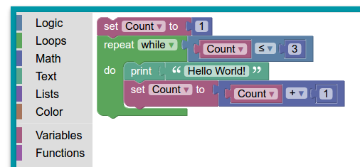
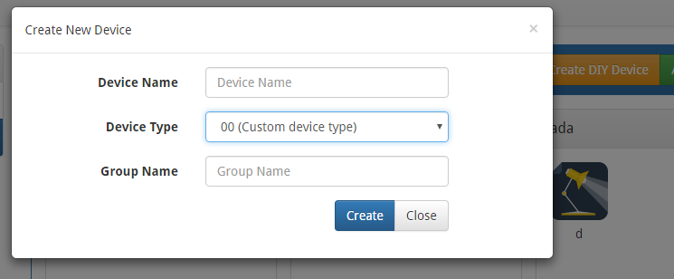
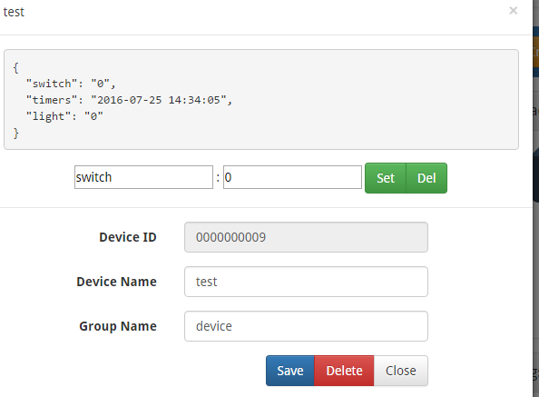
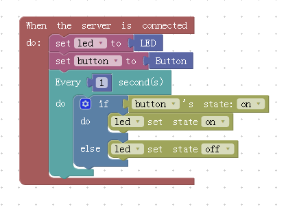
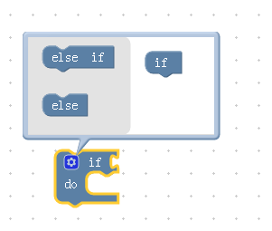
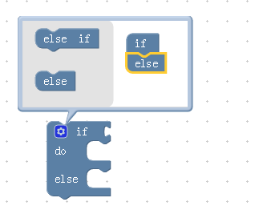
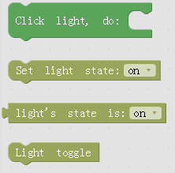

#blockly实现通过按键控制led灯的开关

## 介绍
[Blockly](https://developers.google.com/blockly/)是Google在2012年发布了一种完全可视化的编程语言，类似MIT的儿童编程语言[Scratch](https://scratch.mit.edu/)， 你可以通过类似玩乐高玩具的方式用一块块图形对象构建出应用程序。每个图形对象都是代码块，你可以将它们拼接起来，创造出简单功能，然后将一个个简单功能 组合起来，构建出一个程序。整个过程只需要鼠标的拖曳，不需要键盘敲击。 

Blockly一种在网页上运行的图形化编程语言。使用者以拖拽拼图的方式开发出应用程序，不需要任何的代码编写。

近日，我们用Blockly实现了对连接到LinkSpriteIO云端的设备，进行远程编程，即用完全可视化的编程语言来对物联网中的设备进行编程，实现我们想要的一些功能。

下面我们将用[LinkNode D1](http://www.linksprite.com/wiki/index.php5?title=LinkNode_D1)作为节点设备，然后连接到LinkSpriteIO的IoT云上。Blockly Editor会从LinkSpriteIO上获取节点设备的按键状态，并可以控制节点设备上的LED灯。

通过这样一个实例，详细介绍Blockly如何编程，如何实现对LinkSpriteIO上的设备进行编程。

## 在LinkSpriteIO上创建设备
1. 登陆账号，进入设备列表页面
2. 点击右上角的**Create DIY Device**按钮，进入创建设备
3. 选择**Device Type**为"00"（Custom device type）自定义设备

4. 输入**Device Name**和**Group Name**，记住设备名称
5. 设备创建成功后，创建“switch”（按键）和“light”（灯）两个字段（控制和判断状态）

6. 设备创建成功，点击右上角的**Blockly**，进入blockly编程模块

## 在Blockly中设定要编程的设备

1. 点击右上角“Web Demo area”选择Web和blockly交换页面 

   
2. 将Choose切换到LinkspriteIO就可以获取到当前所有的设备列表  
 

 **注意**:设备列表下的灯泡，可以通过编程对灯泡进行控制，实现与LED设备的同步,编程模块
3. 通过**Group**和**Device Name**选择要编程的设备，就可以将当前的blockly切换到当前设备下，此时就可以对设备进行编程了  

## Blockly图像化编程

1. 根据下图，从左侧栏中拖出各种模块，进行编程
**程序解读**：当服务器链接成功后，将led变量设置成LED属性，将button设置成Button属性。每隔1s去查询一次button的值，当状态为on时，将led灯设为on，否则将led灯设为off。即用button去控制LED的开关，当然还可以添加其他的逻辑实现想要的功能。
2. blockly编程完成后，就可以点击右上角的运行按钮，运行编写的程序  
 
  

## 验证编程的结果 
1. 在刚才创建的设备上, 输入参数名switch，数值为0或1,然后点击**Set**来输入参数，查看**light**的状态。是否跟着switch的状态一起变化？

## 解说各个模块  
----

【链接】“LinkspriteIO”  
【作用】与服务器建立链接  

---

【链接】“LinkspriteIO”->"Led"  
【作用】获取Led灯

-----

【链接】“LinkspriteIO”->"Button"  
【作用】获取按钮

-----

【链接】“LinkspriteIO”->"Led"  
【作用】设置Led的状态，on/off(开/关)

-----

【链接】“LinkspriteIO”->"Led"  
【作用】当Led状态为on/off时，执行的流程  
【注意】因为此处为紧接着led状态改变后执行的操作，所以此处不能执行死循环或耗时操作，否则程序将进入假死状态

---

【链接】“LinkspriteIO”->"Led"  
【作用】获取led的状态（on/off），进行判断操作，一般和if模块结合使用

---

【链接】“LinkspriteIO”->"Led"  
【作用】led灯闪烁，后面为闪烁间隔的时间

---

【链接】“LinkspriteIO”->"Led"  
【作用】led灯状态切换，当led灯当前状态为on时，切换为off,反之，切换为on

---

【链接】“LinkspriteIO”->"Button"  
【作用】获取button的状态（on/off），进行判断操作，一般和if模块结合使用

---

  
【链接】“LinkspriteIO”->"Button"   
【作用】当Button状态为on/off时，执行的流程  
【注意】因为此处为紧接着Button状态改变后执行的操作，所以此处不能执行死循环或耗时操作，否则程序将进入假死状态

---

  
【链接】“Advanced”->"Delay"   
【作用】循环操作，每隔一段时间，执行一次do后面的操作，相当于定时器，每隔一段时间执行一次  

---

  
【链接】“Standard”->"Logic"   
【作用】if判断条件模块，如果条件成立，就执行do后面的流程

---
  
  
【链接】“Standard”->"Logic"   
【作用】if..else,点击if模块右上角设置按钮，会出现如图将else或else if拖到if下面，组成if..else流程
当条件成立，则执行if和面的do流程，否则就执行else后面的流程

## 与网页进行交换

  
【链接】[点击右上角“Web Demo area”选择Web和blockly交换页面  ，获取用户设备列表 ]

【作用】 获取用户的设备列表  

---

【链接】“Web Demo”->"Click Button"   
【作用】  灯的控制
> 1. 点击网页上灯泡图片时，执行的操作  
> 2. 设备网页上灯泡的状态  
> 3. 判断网页上灯泡的状态  
> 4. 网页上灯泡状态的切换   

