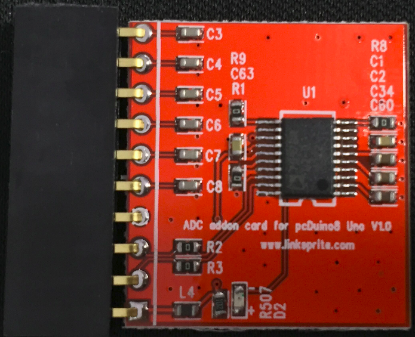
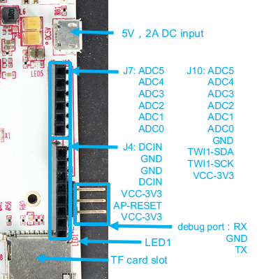

# ADC breakout board for pcDuino8 UNO


## Description
This ADC breakout board is specially designed for pcDuino8 Uno which has no on-board ADC module. It expands 6 ADC channels using ADI AD7997 12-bit ADC module which provides a I2C-compatible interface.

## Feature
* ADI AD7997 12-bit ADC chip
  - 10- and 12-bit ADC
  - 8 single-ended analog input channels (Only use 6 channels)
  - I2C-compatible serial interface
* 3.3V power supply

## Tutorial

### Connect to pcDuino8 Uno
* Solder 90° 10-pins headers on J10 of pcDuino8 Uno
* Plug the ADC breakout board into J10 (as shown in the following picture).


### Quick test
* Install additional package(s) before use **pcduino8_uno_lib** on pcDuino8 Uno
```bash
sudo apt-get install libi2c-dev i2c-tools
```
* Fetch the Arduino lib for pcDuino8 Uno

```bash
git clone https://github.com/pcduino/pcduino8_uno_lib
```
* Clean and Compile the lib:
```
cd pcduino8_uno_lib
make clean
make
sudo ./output/adc_test
```
* Input an analog signal on ADC0 channel



* The adc_test program will print the value of analog signal on ADC0 channel as default.

### Create your own source code for ADC
Create new .c files in samples folder and modify Makefile to compile it. For example I want to create helloADC.c to read the values from all six ADC channels.
* Create `helloADC.c` source file
```
vim samples/helloADC.c
```

```c
#include <core.h>
int adc_id = 0;
void setup()
{
}
void loop()
{
   for(adc_id=0; adc_id<6; adc_id++)
   {
       int value = analogRead(adc_id); // get adc value
       printf("ADC%d value is %d\n",adc_id, value);
       delay(1000); // wait for one sec
   }
}
```
* Update Makefile
```bash
vim samples/makefile
```
* Add a line after OBJS=… and add the name of your program (without suffix ‘.c’).
```makefile
OBJS = i2c_rtc_test spi_nfc_test adc_test led_test
OBJS += uart_test
OBJS += helloADC
```
* Compile and run:
```
make
sudo output/helloADC
```
**Note:** If you have not used the latest system image for pcDuino8 Uno, you have to use add `sudo` to access adc , the following content will tell you how to add permission for user linaro.
```bash
sudo echo "SUBSYSTEM=="i2cdev", GROUP="i2c"" > /etc/udev/rules.d/90-i2c.rules
sudo useradd linaro i2c
sudo reboot
```
