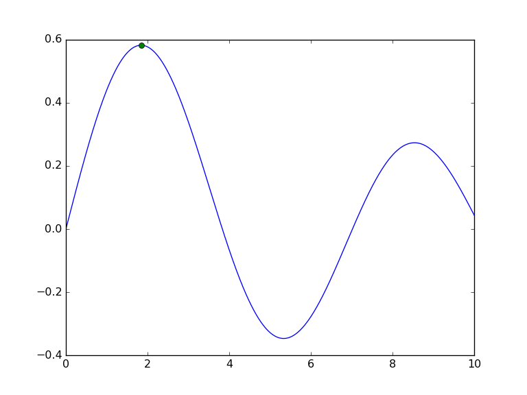

# "Matlab" on pcDuino8 Uno
**SciPy** (pronounced “Sigh Pie”) is a Python-based ecosystem of open-source software for mathematics, science, and engineering. In particular, these are some of the core packages:
- **NumPy** : Base N-dimensional array package
- **SciPy library** : Fundamental library for scientific computing
- **Matplotlib** : Comprehensive 2D Plotting
- **IPython** : Enhanced Interactive Console
- **Sympy** : Symbolic mathematics
- **pandas** : Data structures & analysis

SciPy contains modules for optimization, linear algebra, integration, interpolation, special functions, FFT, signal and image processing, ODE solvers and other tasks common in science and engineering.

This tutorial introduces the installation of **SciPy** on pcDuino8 Uno and quick start of Scipy.  

## Steps
### 1. Install the required libraries
```bash
sudo apt-get install libatlas-dev libavcodec-dev libavformat-dev libboost-all-dev libgtk2.0-dev libjpeg-dev liblapack-dev libswscale-dev pkg-config
sudo apt-get install python-dev python-pip cmake curl gfortran 
sudo apt-get install ipython
```
Although pcDuino8 Uno has 1GB ram, but when I install **numpy** or **scipy**, I get an error which is caused by the limitation of RAM. So before installing these software, I have to add swap partition to solve this problem.

### 2. Add swap partition   
Add 1GB as my swap partition.
```bash
sudo dd if=/dev/zero of=/var/swap.img bs=1M count=1000
sudo mkswap /var/swap.img
sudo swapon /var/swap.img
```

### 3. Install the required software

```bash
sudo pip install numpy    # nearly 2 hours
sudo pip install scipy    # nearly 1.5 hours
sudo pip install pandas   
sudo pip install scikit-learn 
sudo pip install scikit-image
sudo pip install matplotlib
```

## Example
### Bessel function
To give a simple example of typical interactive use, we find and plot the maximum of a Bessel function. 
Get a `example.py` from [SciPy.org](1), the python script is shown as follow:
```python
"""example.py

Compute the maximum of a Bessel function and plot it.

"""
import argparse

import numpy as np
from scipy import special, optimize
import matplotlib.pyplot as plt

def main():
    # Parse command-line arguments
    parser = argparse.ArgumentParser(usage=__doc__)
    parser.add_argument("--order", type=int, default=3, help="order of Bessel function")
    parser.add_argument("--output", default="plot.png", help="output image file")
    args = parser.parse_args()

    # Compute maximum
    f = lambda x: -special.jv(args.order, x)
    sol = optimize.minimize(f, 1.0)

    # Plot
    x = np.linspace(0, 10, 5000)
    plt.plot(x, special.jv(args.order, x), '-', sol.x, -sol.fun, 'o')

    # Produce output
    plt.savefig(args.output, dpi=96)

if __name__ == "__main__":
    main()

```
Run the following command and you will get a picture.
```
python example.py --output example.png --order 1
```


### FFT Function
The example plots the FFT of the sum of two sines. Details please go to this [website](2).
```python

from scipy.fftpack import fft
# Number of samplepoints
N = 600
# sample spacing
T = 1.0 / 800.0
x = np.linspace(0.0, N*T, N)
y = np.sin(50.0 * 2.0*np.pi*x) + 0.5*np.sin(80.0 * 2.0*np.pi*x)
yf = fft(y)
xf = np.linspace(0.0, 1.0/(2.0*T), N/2)
import matplotlib.pyplot as plt
plt.plot(xf, 2.0/N * np.abs(yf[0:N/2]))
plt.grid()
plt.show()
```


**Note**: because the default backend of matplotlib is agg, it can not plot the image, but you can save the image as a file. 

## Resolved: Matplotlib figures not showing up or displaying
Luckily, we can resolve this issue by using `apt-get`  to install a few libraries:
```
sudo apt-get install tcl-dev tk-dev python-tk python3-tk
```
But we’re not quite done yet. In order to get matplotlib to recognize the TkInter GUI library, we need to:

1. Use pip to uninstall matplotlib (since we installed it via pip earlier in this article).
2. Pull down matplotlib from the GitHub repo.
3. Install matplotlib  from source using setup.py .

I can accomplish these steps using the following commands:
```bash
pip uninstall matplotlib
git clone https://github.com/matplotlib/matplotlib.git
cd matplotlib
python setup.py install
```
After **matplotlib**  has been installed via source, let’s execute the `get_backend()`  function:
>linaro@linaro-alip:~/matplotlib$ python  
Python 2.7.6 (default, Mar 22 2014, 23:30:12)   
[GCC 4.8.2] on linux2  
Type "help", "copyright", "credits" or "license" for more information.  
\>>> import matplotlib  
\>>> matplotlib.get_backend()  
u'TkAgg'  

Sure enough, we now see the `TkAgg` is being used as the **matplotlib** backend.

[1]:http://www.scipy.org/getting-started.html
[2]:http://docs.scipy.org/doc/scipy/reference/tutorial/fftpack.html
