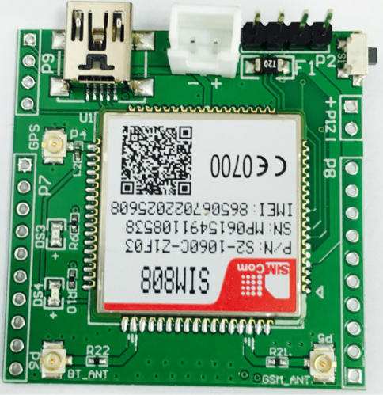

# Introduction of LinkSprite IO

LinkSpriteIO is an IoT cloud which is based on IoTgo open source platform. LinkSprite has released a complete set of hardware for LinkSpriteIO with open source hardware designs and open source firmware.

The overall LinkSpriteIO architecture including LinkSpriteIO cloud, web/desktop/mobile apps and LinkSpriteIO-compatible nodes is illustrated by following graph.

## Web API
LinkSpriteIO provides a RESTful Web API to interact with clients (Web App, Mobile App, Desktop App, etc.).

The general process is as follows:

* Client sends HTTP request to LinkSpriteIO.

    - If it is a POST request, then data must be coded in JSON format and carried in request body.
* LinkSpriteIO does some validation against the request.
    - If the validation failed, LinkSpriteIO will reply with proper response code and reason.
    - If the validation succeeded, LinkSpriteIO will continue processing the request, and reply with 200 OK status code and process result encoded in JSON format.
* Client checks the response from LinkSpriteIO.
    - If the status code is not 200 OK, then the request is probably illegal or bad formed.
    - If the status code is 200 OK, but the data (JSON format) has an error property, then the request still fails. The value of error property is the reason of failure.
    -If the status code is 200 OK, and there is no error property in the data, then the request succeeds (finally!). Extract the data and do whatever you want :smiley:

LinkSpriteIO is also using **JSON Web Token** to protect Web API, so most of these Web API requests must carry `Authorization` header with JSON Web Token obtained from `register` or `login` request.

Single-board microcontroller (like Arduino, ESP8266) developers, single-board computer (like pcDuino, Raspberry PI) developers and other embedded system developers could use LinkSpriteIO Device API to connect their devices to LinkSpriteIO and then easily control their devices by utilizing LinkSpriteIO Web App.

Note: we also provide LinkSpriteIO-compatible Device examples which wraps LinkSpriteIO Device API.

Web developers and mobile developers could use LinkSpriteIO Web API to build various apps that manage devices connected to LinkSpriteIO. To control those devices, LinkSpriteIO Device API can be used.

In one word, we want to provide cloud capability for device developers and device capability for app developers.

## What LinkSpriteIO Can Do?
Let us show you some actual case that using LinkSpriteIO!

#### Weather station

#### GPS tracker

#### WiFi relay controller

#### Smart WiFi Power Socket
 

#### Gas Detection Alarm [Mobile control and SMS alarm]

